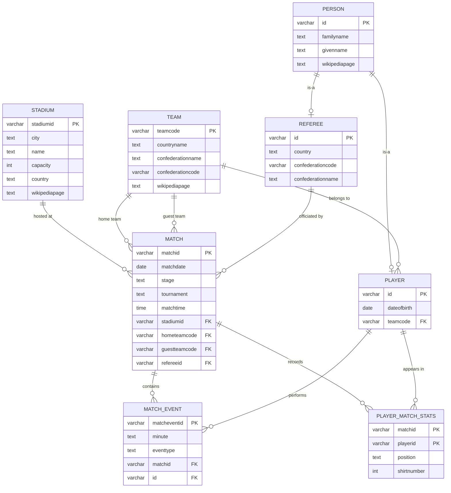
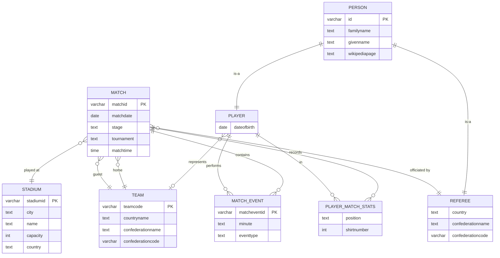
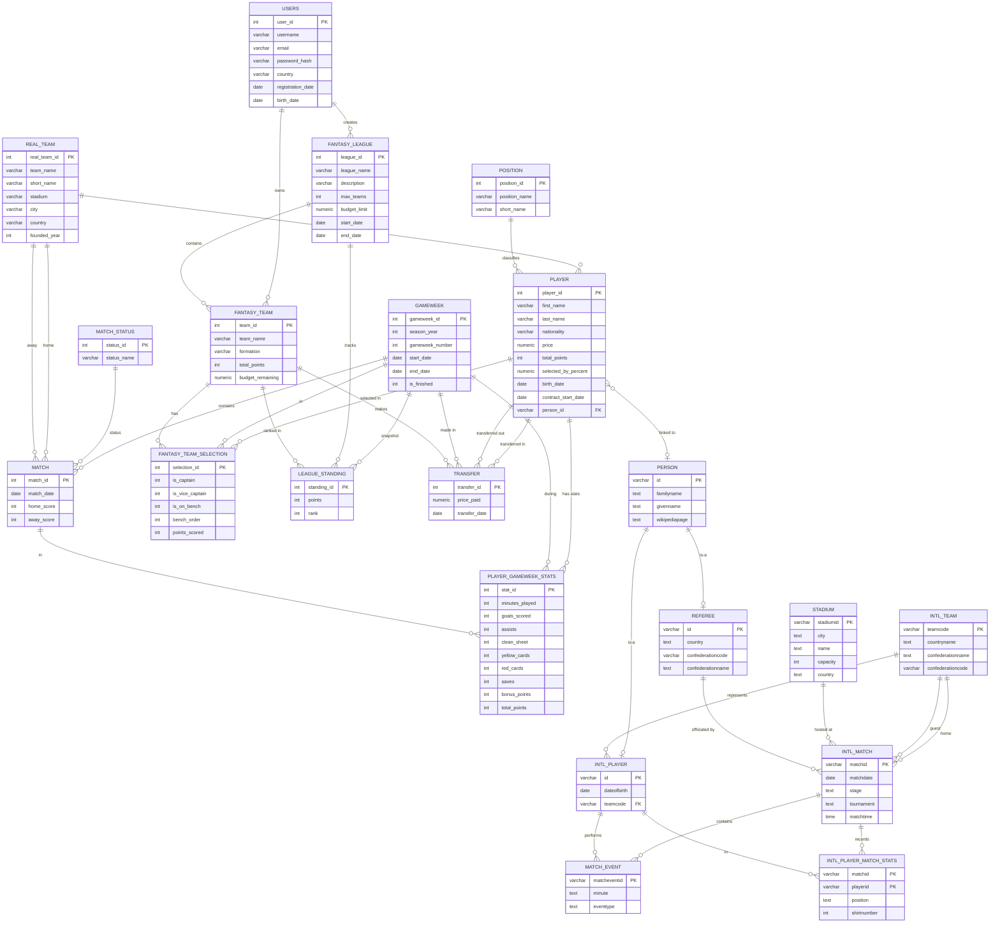
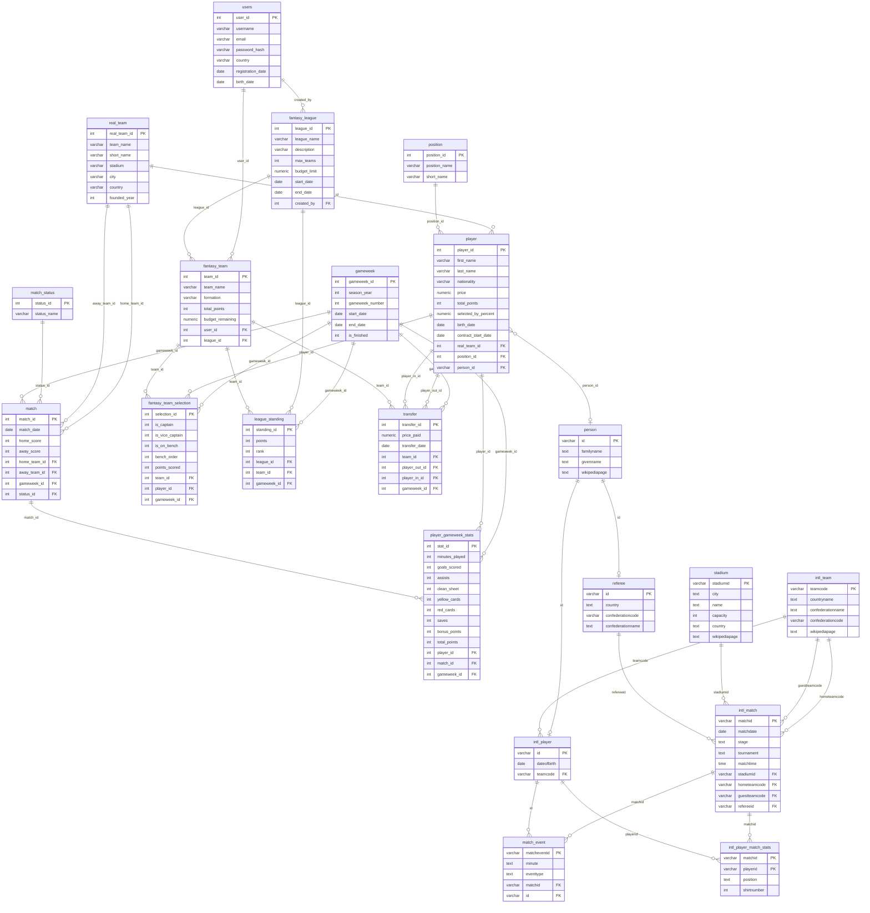

# Phase C — Database Integration

**Submitters:** Ariel Zourno, Ariel Namir, Uria Shahor

---

## Table of Contents

1. [Introduction](#introduction)
2. [The Two Systems](#the-two-systems)
3. [DSD — Received System (FIFA World Cup)](#dsd--received-system-fifa-world-cup)
4. [ERD — Received System (Reverse Engineered)](#erd--received-system-reverse-engineered)
5. [Reverse Engineering Algorithm](#reverse-engineering-algorithm)
6. [Integration Decisions](#integration-decisions)
7. [Combined ERD](#combined-erd)
8. [Combined DSD](#combined-dsd)
9. [Integration Process — Integrate.sql](#integration-process--integratesql)
10. [Views and Queries — Views.sql](#views-and-queries--viewssql)

---

## Introduction

In this phase we received a database backup from another group and merged it with our own Fantasy Football (Premier League) database into a single unified schema. The integration was performed using **Method A**: all tables from the received system were added to our existing database using `CREATE TABLE` commands, conflicting table names were resolved by renaming, and an `ALTER TABLE` command was used to add a foreign-key link between the two systems. No data was lost and all Phase B queries continue to run without modification on the merged database.

---

## The Two Systems

| System | Domain | Tables |
|--------|--------|--------|
| **Ours** | Premier League Fantasy Football | 13 tables — users, real teams, players, matches, gameweeks, fantasy leagues, fantasy teams, selections, standings, transfers, positions, player stats, match statuses |
| **Received (RL)** | FIFA World Cup (1970–2018) | 8 tables — persons, national teams, stadiums, referees, players, matches, match events, player match stats |

The natural integration bridge between the two systems is the **player**: a footballer who plays for a Premier League club may also have appeared in World Cup data. This connection is captured by a new `person_id` foreign key added to our `player` table, pointing to the `person` table from the received system.

---

## DSD — Received System (FIFA World Cup)

> **Screenshot this Mermaid diagram and save as `images/dsd_rl.png`**



---

## ERD — Received System (Reverse Engineered)

> **Screenshot this Mermaid diagram and save as `images/erd_rl.png`**



---

## Reverse Engineering Algorithm

The ERD above was derived from the received database tables using the following process:

1. **Each table with a single primary key becomes an entity.** `person`, `team`, `stadium`, `match`, and `match_event` each have one PK and became independent entities.

2. **A table whose PK is also a FK to another table represents an ISA (subtype) relationship.** `player.id` is both a PK and a FK referencing `person.id`. Same for `referee.id`. These became subtype entities of `PERSON`.

3. **A table whose PK is a composite of two FKs represents a many-to-many relationship.** `player_match_stats` has a composite PK `(matchid, playerid)`, both of which are FKs. This became a relationship entity (associative entity) between `MATCH` and `PLAYER`.

4. **FK columns that are not part of the PK represent many-to-one relationships.** For example, `player.teamcode` is a FK to `team` but not part of the player's PK — a player belongs to one national team, a team has many players.

5. **Duplicate FK columns pointing to the same table represent distinct roles.** `match.hometeamcode` and `match.guestteamcode` both reference `team`, so `MATCH` has two separate relationships with `TEAM` — one for each role.

6. **Non-key columns that describe a concept from another domain were kept as attributes**, not promoted to new entities, because they are not referenced by any FK (e.g., `stage`, `tournament` in `match`).

---

## Integration Decisions

| Decision | Reasoning |
|----------|-----------|
| Rename `team` → `intl_team` | Both systems have a "team" concept: ours are Premier League clubs, theirs are national teams. Renaming makes the distinction explicit and avoids a name collision. |
| Rename `player` → `intl_player` | Same collision issue. A club player (our `player`) and a World Cup player (their `player`) represent the same real-world person but are modelled differently; a rename preserves both without confusion. |
| Rename `match` → `intl_match` | Our `match` holds Premier League fixtures; their `match` holds World Cup fixtures. The schemas are incompatible (ours has scores and a status; theirs has a tournament, stage, stadium, and referee), so merging them into one table was not appropriate. |
| Rename `player_match_stats` → `intl_player_match_stats` | Follows from renaming `match` and `player`. |
| Keep `person`, `stadium`, `referee`, `match_event` as-is | No name collisions and the entities are distinct enough to stand alone. |
| Add `person_id VARCHAR(50)` to our `player` table | This is the integration link: a Premier League player who also played in World Cup data can be identified as the same person. The column is nullable because most club players in the fantasy dataset are fictional/generated and have no corresponding World Cup record. |
| No FK from `real_team` to `intl_team` | Premier League clubs and national football teams are fundamentally different entities with no direct parent–child relationship. Forcing a FK here would be semantically wrong. |
| No structural merge of `match` and `intl_match` | The two match tables have different mandatory columns and serve completely different query patterns. Merging them into one table with many nullable columns would violate 1NF intent and make every query more complex. |

---

## Combined ERD

> **Screenshot this Mermaid diagram and save as `images/erd_combined.png`**



---

## Combined DSD

> **Screenshot this Mermaid diagram and save as `images/dsd_combined.png`**



---

## Integration Process — Integrate.sql

The `Integrate.sql` file performs the full integration in three steps.

### Step 1 — Create the new tables

Eight tables from the received system are created in `mydatabase`. Four of them are renamed to avoid collisions with our existing tables:

| Original name | Name in integrated DB | Reason for rename |
|---|---|---|
| `team` | `intl_team` | Collides conceptually with our `real_team` |
| `player` | `intl_player` | Collides with our `player` table |
| `match` | `intl_match` | Collides with our `match` table |
| `player_match_stats` | `intl_player_match_stats` | Follows from `match` and `player` rename |

```sql
CREATE TABLE public.person (
    id            CHARACTER VARYING(50) NOT NULL,
    familyname    TEXT,
    givenname     TEXT NOT NULL,
    wikipediapage TEXT,
    CONSTRAINT person_pkey PRIMARY KEY (id)
);

CREATE TABLE public.intl_team (
    teamcode          CHARACTER VARYING(50) NOT NULL,
    countryname       TEXT NOT NULL,
    confederationname TEXT NOT NULL,
    confederationcode CHARACTER VARYING(50) NOT NULL,
    wikipediapage     TEXT,
    CONSTRAINT intl_team_pkey PRIMARY KEY (teamcode)
);

-- ... (stadium, referee, intl_player, intl_match, match_event, intl_player_match_stats)
```

### Step 2 — Modify the existing `player` table

A nullable foreign key column is added to our `player` table to link club players to their international identity in the World Cup data:

```sql
ALTER TABLE public.player
    ADD COLUMN person_id CHARACTER VARYING(50),
    ADD CONSTRAINT player_person_id_fkey
        FOREIGN KEY (person_id) REFERENCES public.person(id);
```

This column is intentionally nullable: the fantasy dataset contains generated players with no real-world counterpart, so most rows will have `NULL` here. Only players who actually appeared in the World Cup data can be linked.

### Step 3 — Import the data

All rows from the received backup are inserted into the new tables. Counts after import:

| Table | Rows |
|---|---|
| `person` | 8,287 |
| `intl_team` | 84 |
| `stadium` | 185 |
| `referee` | 380 |
| `intl_player` | 7,907 |
| `intl_match` | 700 |
| `match_event` | 10,722 |
| `intl_player_match_stats` | 18,623 |

### Verification — Phase B queries still work

After the integration all Phase B queries were re-run on the merged database and produced correct results. As an example:

```sql
-- Phase B Query 1: Players born in 2002 playing for English clubs
SELECT p.first_name, p.last_name, p.price,
       EXTRACT(YEAR FROM p.birth_date) AS birth_year
FROM player p
WHERE EXTRACT(YEAR FROM p.birth_date) = 2002
  AND p.real_team_id IN (
      SELECT real_team_id FROM real_team WHERE country = 'England'
  );
```

The new `person_id` column added to `player` has no effect on this query because it is nullable and not referenced.

---

## Views and Queries — Views.sql

### View 1: Fantasy Football Perspective — `v_fantasy_player_profile`

This view presents a combined player profile for the fantasy game, joining the `player`, `real_team`, and `position` tables. It gives a scout-style summary: full name, position, club, price, fantasy points earned, and ownership percentage.

```sql
CREATE VIEW v_fantasy_player_profile AS
SELECT
    p.player_id,
    p.first_name || ' ' || p.last_name  AS player_name,
    pos.position_name,
    pos.short_name                        AS pos_short,
    rt.team_name                          AS club_team,
    rt.country                            AS club_country,
    p.price,
    p.total_points,
    p.selected_by_percent,
    p.nationality
FROM public.player      p
JOIN public.real_team   rt  ON p.real_team_id  = rt.real_team_id
JOIN public.position    pos ON p.position_id   = pos.position_id;
```

**Sample output (`SELECT * ... LIMIT 10`):**


---

#### Q1-A — Top 10 highest-scoring players

Answers the question: which players have accumulated the most fantasy points, regardless of position or price?

```sql
SELECT player_name, position_name, club_team, price, total_points
FROM   v_fantasy_player_profile
ORDER  BY total_points DESC
LIMIT  10;
```


---

#### Q1-B — Most expensive player per position

Answers the question: what is the priciest option available in each position?

```sql
SELECT DISTINCT ON (position_name)
    position_name,
    player_name,
    club_team,
    price
FROM   v_fantasy_player_profile
ORDER  BY position_name, price DESC;
```


---

### View 2: FIFA World Cup Perspective — `v_world_cup_match_details`

This view presents a human-readable match record for every World Cup fixture, replacing team codes and stadium IDs with full names. It joins `intl_match`, two instances of `intl_team` (home and guest), and `stadium`.

```sql
CREATE VIEW v_world_cup_match_details AS
SELECT
    im.matchid,
    im.tournament,
    im.stage,
    im.matchdate,
    home_t.countryname  AS home_team,
    guest_t.countryname AS guest_team,
    s.name              AS stadium_name,
    s.city              AS stadium_city,
    s.country           AS stadium_country,
    s.capacity          AS stadium_capacity,
    im.matchtime
FROM public.intl_match   im
JOIN public.intl_team    home_t  ON im.hometeamcode  = home_t.teamcode
JOIN public.intl_team    guest_t ON im.guestteamcode = guest_t.teamcode
JOIN public.stadium      s       ON im.stadiumid     = s.stadiumid;
```

**Sample output (`SELECT * ... LIMIT 10`):**


---

#### Q2-A — Number of matches per tournament

Answers the question: how many fixtures were played in each World Cup edition?

```sql
SELECT tournament, COUNT(*) AS match_count
FROM   v_world_cup_match_details
GROUP  BY tournament
ORDER  BY match_count DESC;
```


---

#### Q2-B — All World Cup Final matches

Answers the question: who played in each World Cup Final, and where?

```sql
SELECT tournament, matchdate, home_team, guest_team, stadium_name, stadium_city
FROM   v_world_cup_match_details
WHERE  stage = 'final'
ORDER  BY matchdate;
```


