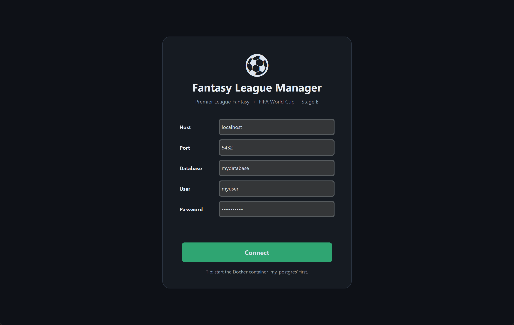
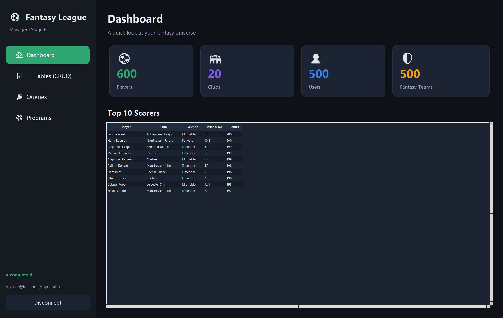
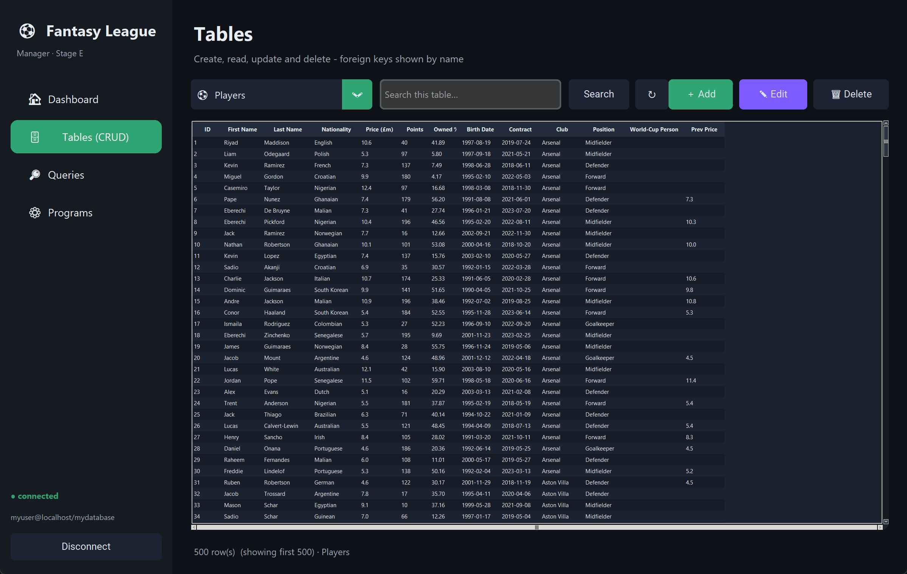
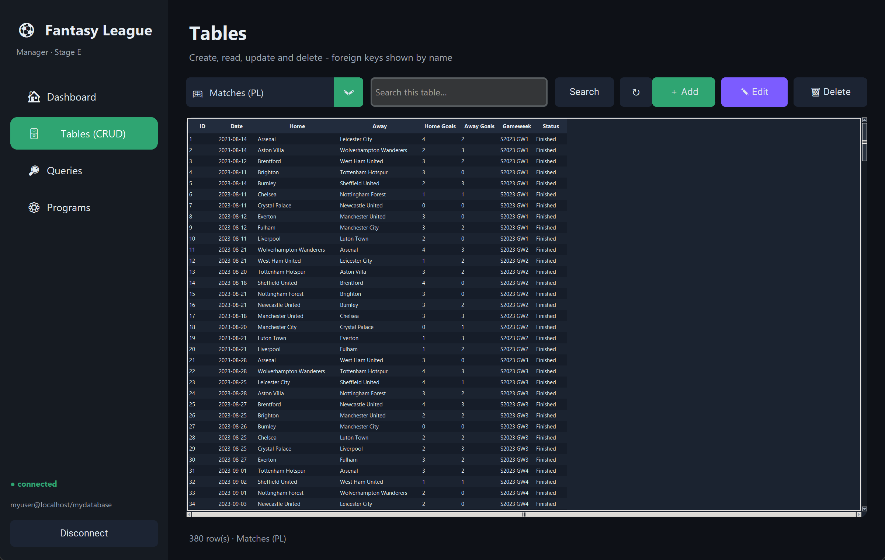
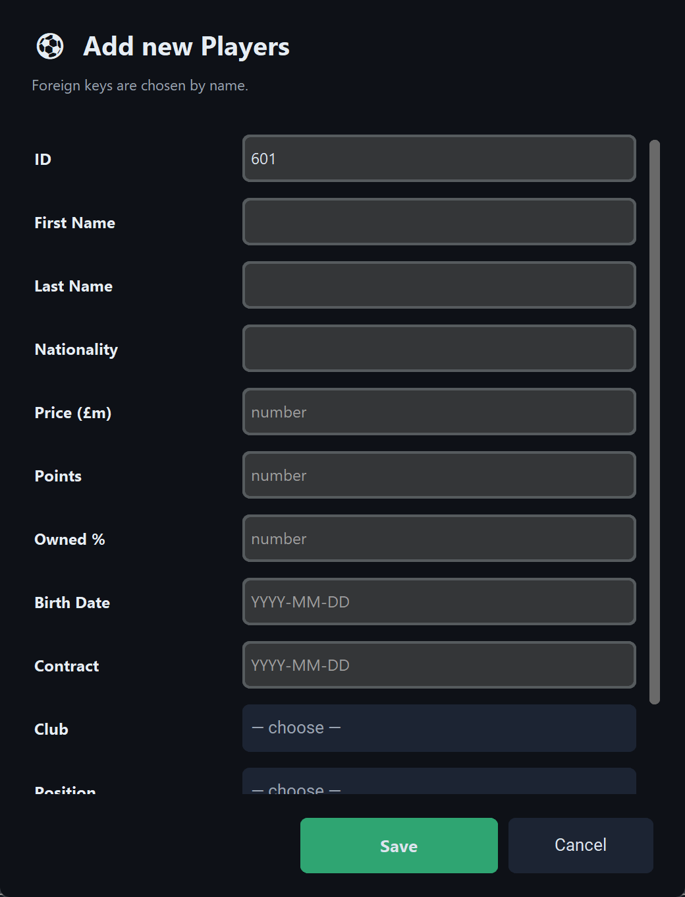
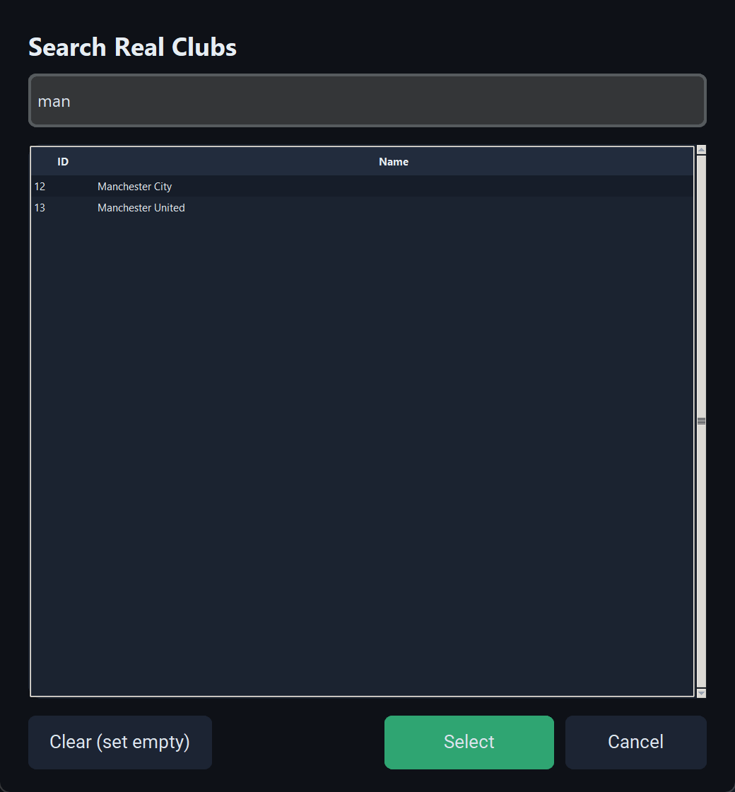
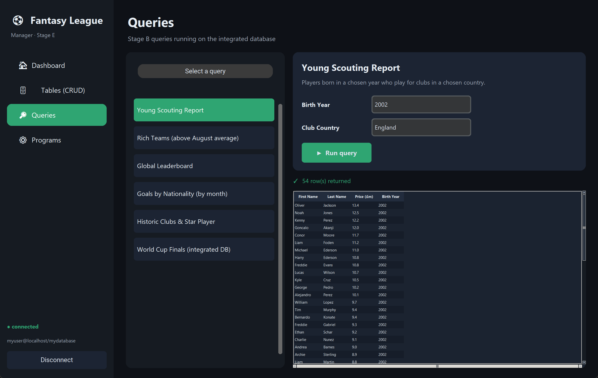
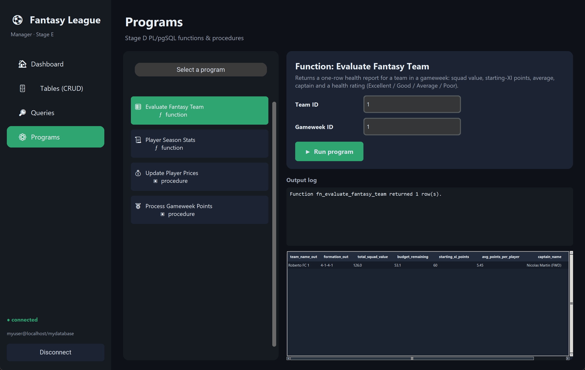
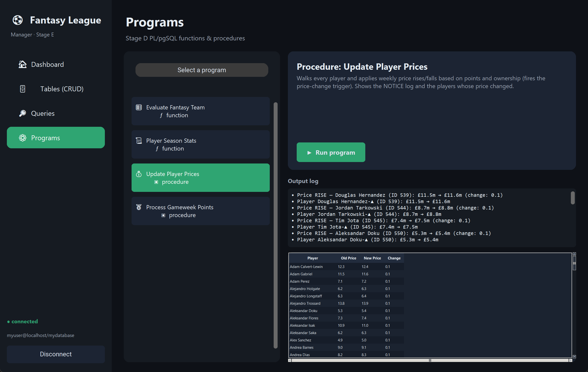

# Stage E — Graphical Application (GUI)

**Project:** Fantasy Premier League ⚽ + FIFA World Cup 🌍 (integrated database)
**Submitters:** Ariel Zourno, Ariel Namir, Uria Shahor

A desktop application that connects to our PostgreSQL database (`mydatabase`) and
lets a user work with **every table** through full CRUD, run our **Stage B
queries**, and execute our **Stage D functions and procedures** — all from a
modern, themed interface.

---

## Table of Contents
1. [How to run](#how-to-run)
2. [Tools & how it was built](#tools--how-it-was-built)
3. [Requirements coverage](#requirements-coverage)
4. [Screens](#screens)
5. [Project structure](#project-structure)

---

## How to run

### 1. Prerequisites
* **Python 3.10+** (developed on 3.13).
* The **PostgreSQL database** running. In our setup it is the Docker container
  `my_postgres` (PostgreSQL 18) holding the database `mydatabase`.

  ```bash
  docker start my_postgres
  ```

  Default connection used by the app:

  | Field | Value |
  |-------|-------|
  | Host | `localhost` |
  | Port | `5432` |
  | Database | `mydatabase` |
  | User | `myuser` |
  | Password | `mypassword` |

### 2. Install the Python dependencies
```bash
pip install -r requirements.txt
```
(That installs `psycopg2-binary` for the database connection and
`customtkinter` for the modern UI.)

### 3. Start the app
* **Windows:** double-click **`run.bat`**, **or**
* From a terminal:
  ```bash
  cd app
  python app.py
  ```

The **Connection** screen opens first. The connection details are pre-filled;
press **Connect** to enter the system. They are remembered in `app/config.json`
for next time.

---

## Tools & how it was built

| Layer | Choice | Why |
|-------|--------|-----|
| Language | **Python 3** | Allowed by the assignment and integrates cleanly with PostgreSQL. |
| Database driver | **psycopg2** | The standard PostgreSQL adapter; supports `CALL`, REF CURSORs and `NOTICE` capture, which our Stage D programs need. |
| GUI toolkit | **CustomTkinter** | A modern, themed wrapper over Tkinter — rounded cards, a dark theme and a sidebar, while staying in the Tkinter family suggested by the assignment. |
| Data grids | **ttk.Treeview** (custom-styled) | Fast, sortable tabular display, restyled to match the dark theme. |

**Design idea.** The whole app is *metadata-driven*. Every table is described
once in `metadata.py` (its primary key, columns, types and **foreign-key
targets**). From that single description the app automatically builds the browse
query, the add/edit forms and the foreign-key pickers. This is what makes the
"never show a raw foreign-key id — always show the name" rule work everywhere
without hand-writing a screen per table.

A few implementation highlights:
* **Foreign keys shown as names.** When listing a table, every FK column is
  `LEFT JOIN`ed to its target and the target's friendly label is shown — e.g.
  a player's club appears as *"Arsenal"*, the position as *"Midfielder"*, never
  as `5`.
* **Picking foreign keys by name.** In add/edit forms a FK field opens a
  searchable picker (e.g. type *"man"* → *Manchester City / Manchester United*)
  and stores the id behind the scenes.
* **Update flow.** Per the spec, the user selects a row (the key); the system
  then **loads all current field values** into the form for editing.
* **Stage D programs.** Set-returning functions are shown as a grid; the REF
  CURSOR function is opened and fully fetched inside one transaction; procedures
  are run with `CALL` and their `RAISE NOTICE` output is captured and displayed.
* **Safety.** Every statement uses parameter binding (`%s`), so the app is safe
  against SQL injection and handles dates/numerics correctly.

---

## Requirements coverage

| Assignment requirement | Where it is met |
|------------------------|-----------------|
| Entry screen to reach all system screens | **Connection** screen → sidebar with Dashboard / Tables / Queries / Programs |
| Screens that reach **all** tables | **Tables** screen — a dropdown of all **21** tables |
| 4 CRUD operations on every table | **Add / Read (grid) / Edit / Delete** buttons |
| Update: user supplies the key, system brings the rest | Select a row → the edit form is pre-loaded with current values |
| Never show foreign-key **ids**, show **names** | FK columns are joined and displayed as names everywhere; FK inputs are name pickers |
| Run ≥ 2 Stage B queries | **Queries** screen — **6** queries (several interactive) |
| Run ≥ 2 Stage D procedures/functions | **Programs** screen — **2 functions + 2 procedures** |
| Effects of procedures/functions are visible | Procedures show their `NOTICE` log and a result grid (changed prices / new standings) |
| User-friendly, attractive design | Dark themed UI, sidebar navigation, cards, zebra grids |

---

## Screens

### Connection
The first screen. Enter (or accept) the database connection details and connect.



### Dashboard
At-a-glance counters and the current top-10 scorers.



### Tables — full CRUD (foreign keys shown as names)
Pick any of the 21 tables, search, and Add / Edit / Delete. Notice **Club** and
**Position** are shown as names, not ids.



The Matches table resolves *three* foreign keys at once — home club, away club
and status — all as names:



### Add / Edit form
Generated from the table's metadata. The id is suggested automatically, fields
are typed (numbers, `YYYY-MM-DD` dates), and foreign keys are chosen by name.



### Foreign-key picker
Search a referenced table by name and select a row — the id is stored behind the
scenes.



### Queries (Stage B)
Choose a query, fill any parameters, and run. Results appear in a grid with a row
count.



### Programs (Stage D)
Run our functions and procedures. A set-returning function shows its result grid:



A procedure shows its live `NOTICE` log **and** the data it changed:



---

## Project structure

```
StageE/
├── app/
│   ├── app.py            # main application + all screens
│   ├── db.py             # PostgreSQL access layer (psycopg2)
│   ├── metadata.py       # description of all 21 tables + SQL builders
│   ├── programs.py       # Stage B queries + Stage D programs
│   ├── widgets.py        # data grid, FK picker, add/edit form
│   ├── theme.py          # colours, fonts, grid styling
│   ├── _screenshots.py   # helper used to generate the screenshots below
│   └── config.json       # last-used connection settings (auto-created)
├── screenshots/          # screen captures used in this report
├── requirements.txt      # Python dependencies
├── run.bat               # Windows launcher
└── README.md             # this report
```

### Queries available (Stage B)
1. **Young Scouting Report** — players born in a year, in a chosen country *(params)*
2. **Rich Teams** — teams above the average budget of August leagues
3. **Global Leaderboard** — teams above a points threshold in a chosen season *(params)*
4. **Goals by Nationality** — goals per nationality in a chosen month *(params)*
5. **Historic Clubs & Star Player** — clubs founded before a chosen year *(params)*
6. **World Cup Finals** — runs across the integrated FIFA tables

### Programs available (Stage D)
1. **Function** `fn_evaluate_fantasy_team(team_id, gameweek_id)` — squad health report
2. **Function** `fn_get_player_season_stats(player_id)` — REF CURSOR of season stats
3. **Procedure** `pr_update_player_prices()` — weekly price rises/falls (+ trigger)
4. **Procedure** `pr_process_gameweek_points(gameweek_id)` — scores a gameweek & ranks the league
